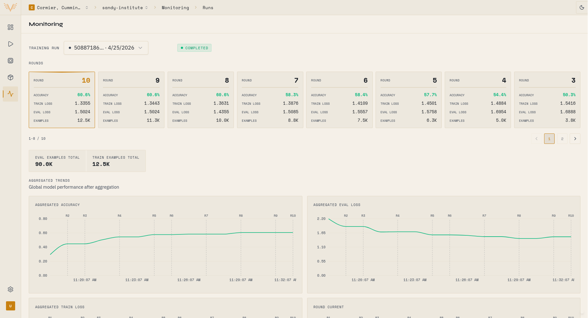
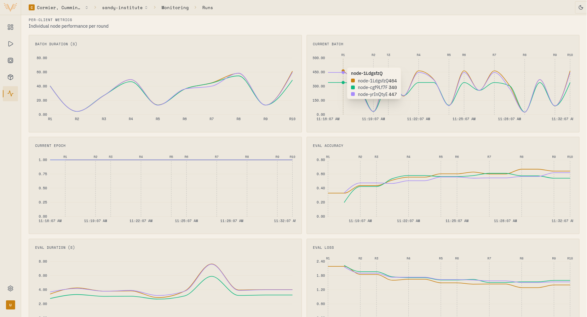

## Screenshots





## Como testar

### 1. Preparar banco de dados e obter credenciais

Entre no container do backend:
```bash
docker exec -it platform-backend bash
```

Execute as migrations e o seed:
```bash
cd apps/backend && pnpm prisma:deploy && pnpm db:seed
```

**Salve as seguintes informações do output:**
- Access token do primeiro usuário
- fabId gerado no seed

### 2. Configurar autenticação

Use o access token em todas as chamadas:
```bash
export ACCESS_TOKEN="seu_token_aqui"
```

### 3. Criar recursos

**a) Obter organização:**
```bash
GET /v1/organizations
# Pegue o ID da organização onde você é dono
export ORG_ID="organization-id"
```

**b) Obter projeto:**
```bash
GET /v1/organizations/{organizationId}/projects
# Pegue o ID do projeto criado no seed
export PROJECT_ID="project-id"
```

**c) Criar nodes associados ao projeto:**
```bash
POST /v1/organizations/{organizationId}/nodes
{
  "name": "client-node-1",
  "projectId": "{projectId}"  # ← Associa automaticamente à federação do projeto
}

POST /v1/organizations/{organizationId}/nodes
{
  "name": "client-node-2",
  "projectId": "{projectId}"
}
```

**Salve os PSKs retornados e os node IDs!**

**d) Criar training run:**
```bash
POST /v1/projects/{projectId}/trainings
{
  "fabId": "{fabId do seed}"
}
# Salve o trainingId retornado
export TRAINING_ID="training-id"
```

### 4. Subir SuperNodes

Use os PSKs obtidos para iniciar os containers:

**SuperNode 1:**
```bash
docker run \
  --name supernode-1 \
  --network mentishub-network \
  -e NODE_PSK="SEU_PSK_1_AQUI" \
  -e OTEL_EXPORTER_OTLP_ENDPOINT="otel-collector:4318" \
  -v client-1-certs:/app/certs \
  mentishub/fl-app:latest \
  flower-supernode \
  --isolation subprocess \
  --health-server-address 0.0.0.0:9099 \
  --superlink superlink:9092 \
  --root-certificates /home/app/.flwr/certificates/ca.crt \
  --auth-supernode-private-key /app/certs/ec_private.key \
  --node-config 'partition-id=0'
```

**SuperNode 2:**
```bash
docker run \
  --name supernode-2 \
  --network mentishub-network \
  -e NODE_PSK="SEU_PSK_2_AQUI" \
  -e OTEL_EXPORTER_OTLP_ENDPOINT="otel-collector:4318" \
  -v client-2-certs:/app/certs \
  mentishub/fl-app:latest \
  flower-supernode \
  --isolation subprocess \
  --health-server-address 0.0.0.0:9099 \
  --superlink superlink:9092 \
  --root-certificates /home/app/.flwr/certificates/ca.crt \
  --auth-supernode-private-key /app/certs/ec_private.key \
  --node-config 'partition-id=1'
```

### 5. Executar treinamento

**a) Deploy ServerApp:**
```bash
POST /v1/projects/{projectId}/trainings/{trainingId}/deploy
```

**b) Aguardar inicialização:**
- Verifique os logs dos SuperNodes
- Espere até que ambos instalem as dependências (status: READY)

**c) Iniciar treinamento:**
```bash
POST /v1/projects/{projectId}/trainings/{trainingId}/run
```

**Pronto!** O treinamento federado começará automaticamente com todos os nodes READY do projeto.
