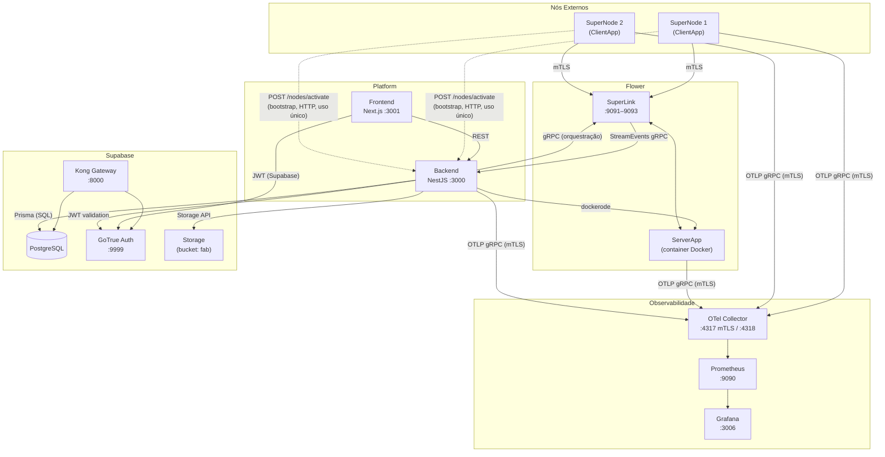
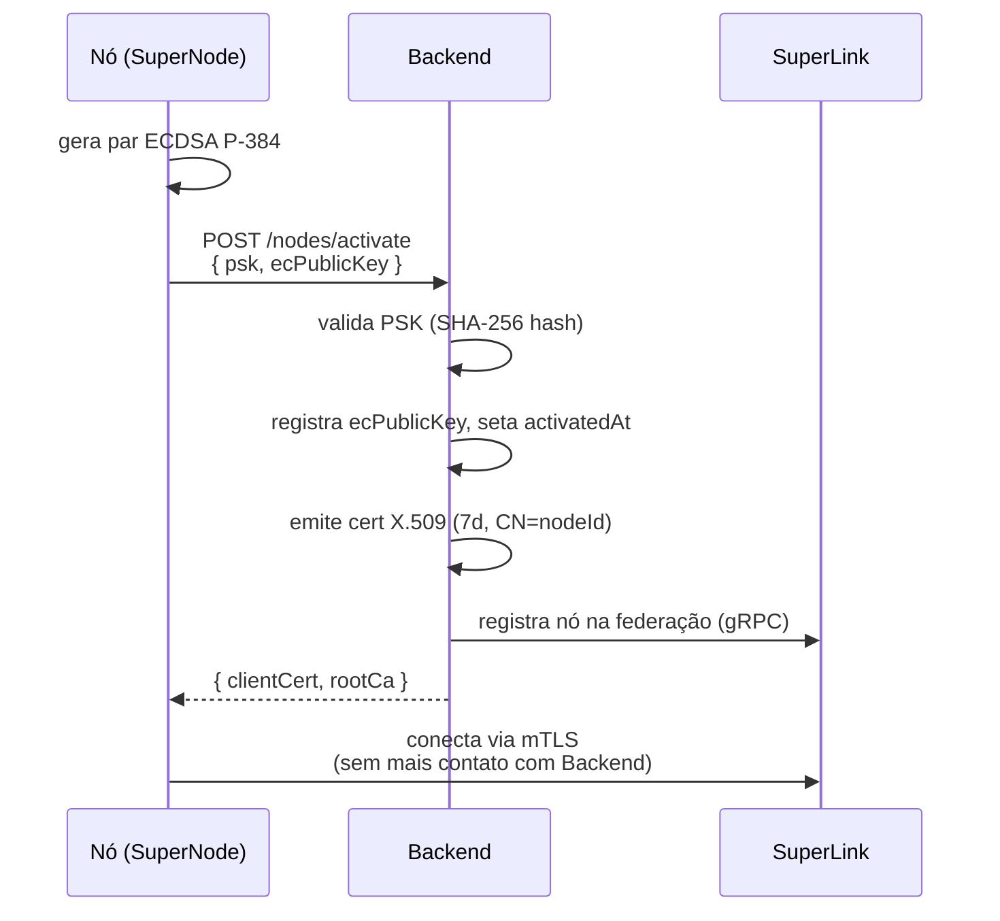
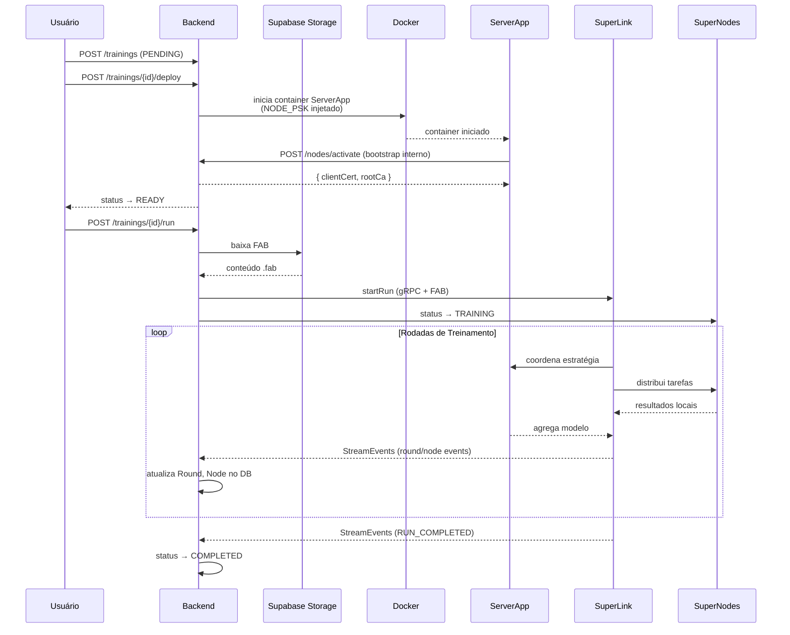
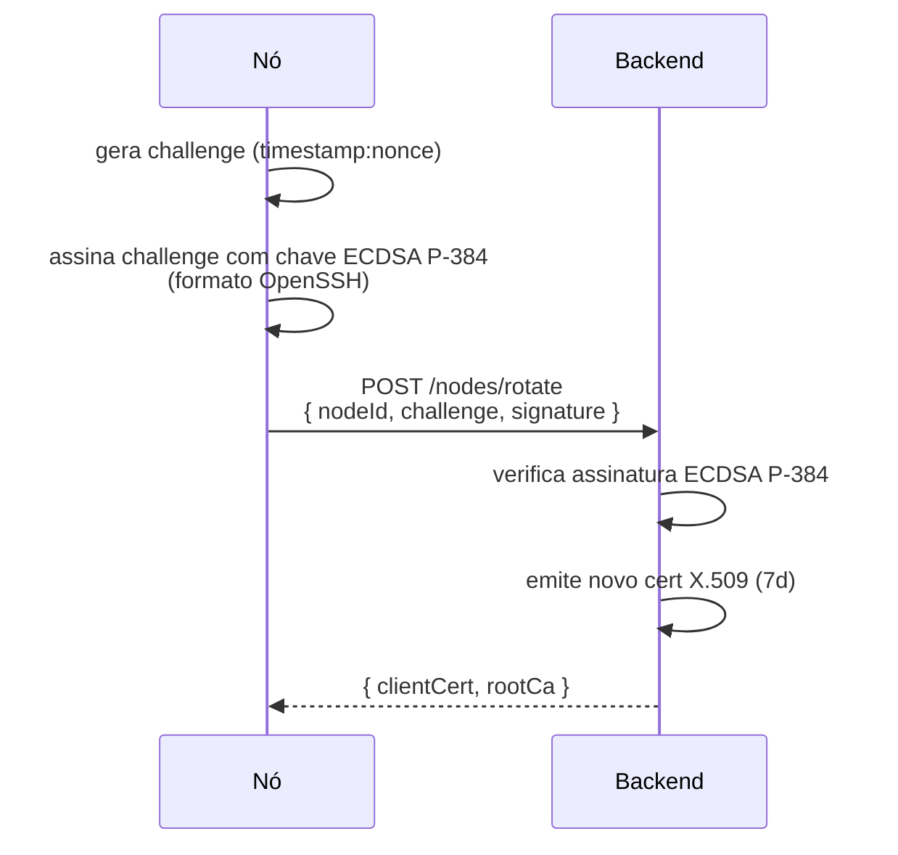

# Documento de Definição da Arquitetura

## 1. Diagrama Arquitetural

---

## 2. Componentes

| Componente | Tecnologia | Porta(s) | Descrição |
|---|---|---|---|
| **Backend** | NestJS 11 (Node.js 25) | 3000 | API REST versionada (URI v1), orquestração de treinamento, emissão de certificados, integração Flower |
| **Frontend** | Next.js 16, React 19 | 3001 | Interface do usuário |
| **SuperLink** | Flower (fork `mentishub`) | 9091–9093 | Coordenador central da federação; gRPC para ServerApp, ClientApps e Backend |
| **ServerApp** | Python, Flower | — | Container Docker gerenciado pela plataforma via `dockerode`; executa estratégia FL |
| **ClientApp / SuperNode** | Python, Flower, PyTorch | — | Nó externo; executa treinamento local; conecta-se ao SuperLink via mTLS |
| **PostgreSQL (Supabase)** | supabase/postgres 17 | 5432 | Banco de dados principal; schema `platform` |
| **Supabase Auth** | GoTrue | 9999 | Autenticação de usuários (JWT) |
| **Supabase Storage** | storage-api | 5000 | Armazenamento de FABs (bucket `fab`) |
| **Kong** | Kong 3.x | 8000 / 8443 | Gateway da API Supabase |
| **OTel Collector** | otel-contrib | 4317 / 4318 | Recebe telemetria (mTLS obrigatório na 4317); exporta para Prometheus |
| **Prometheus** | Prometheus 3.x | 9090 | Backend de métricas |
| **Grafana** | Grafana 12 | 3006 | Dashboards de observabilidade |

---

## 3. Fluxos Principais

### 3.1 Bootstrap de Nó

### 3.2 Ciclo de Treinamento

### 3.3 Renovação de Certificado

---

## 4. Segurança e Autenticação

| Caminho | Mecanismo |
|---|---|
| Usuário → Backend | Supabase JWT; validado pelo `APP_GUARD` global |
| Nó → Backend (bootstrap) | PSK `{base32NodeId}.{base64urlSecret}` — uso único |
| Nó → Backend (renovação) | Challenge-response ECDSA P-384 (OpenSSH signature) |
| Nó / ServerApp → SuperLink | mTLS com cert X.509 emitido pela Root CA da plataforma |
| Backend → SuperLink | gRPC com cert de serviço da plataforma |
| Todos → OTel Collector | mTLS obrigatório (porta 4317) |

**PKI:** Root CA única para toda a plataforma (`@peculiar/x509`). Certs de nós: TTL 7 dias, `CN={nodeId}`, SAN `spiffe://mentishub/node/{nodeId}`. Sem CAs intermediárias por organização.

---

## 5. Rede

Todos os serviços operam na rede Docker `mentishub-network`. Comunicação entre serviços usa hostnames de serviço — nunca `localhost`. Portas expostas ao host somente para desenvolvimento.
