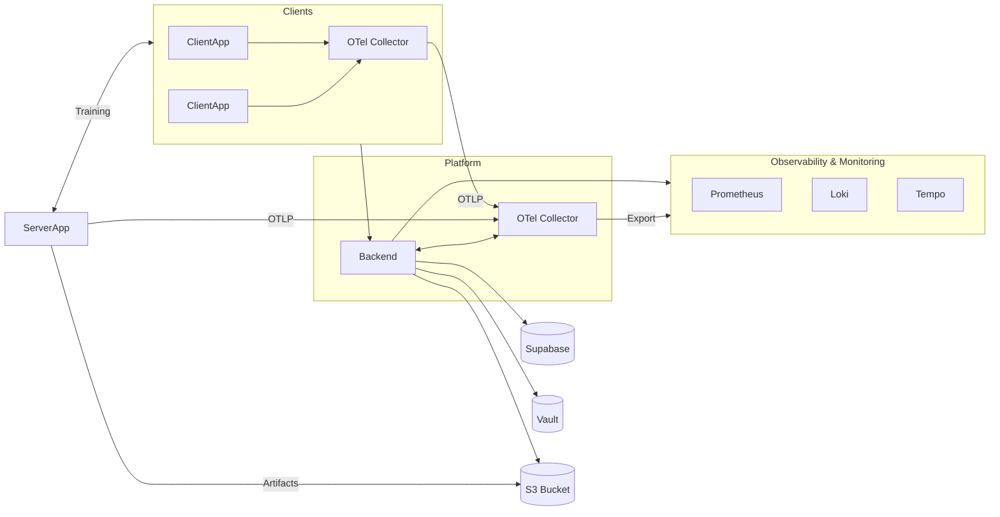

# Documento de Definição da Arquitetura

## 1. Diagrama Arquitetural

```mermaid
flowchart LR
    subgraph Clients
        CA1[ClientApp]
        CA2[ClientApp]
        C_OTEL[OTel Collector]
        CA1 --> C_OTEL
        CA2 --> C_OTEL
    end

    subgraph Platform
        P_BE[Backend]
        P_OTEL[OTel Collector]
    end

    subgraph Obs["Observability & Monitoring"]
        PROM[Prometheus]
        LOKI[Loki]
        TEMPO[Tempo]
    end

    SB[(Supabase)]
    VL[(Vault)]
    S3[(S3 Bucket)]
    SA[ServerApp]

    P_BE --> SB
    P_BE --> VL
    P_BE --> S3
    Clients --> P_BE
    C_OTEL -- OTLP --> P_OTEL
    SA -- OTLP --> P_OTEL

    P_BE <--> P_OTEL
    P_BE --> Obs
    P_OTEL -- Export --> Obs

    SA -- Artifacts --> S3
    SA <-- Training --> Clients
```
