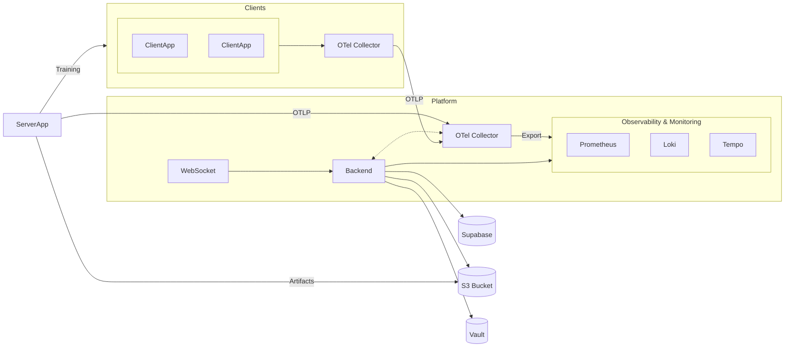

# Documento de Definição da Arquitetura

## 1. Diagrama Arquitetural

---

# **2. Descrição dos Componentes**

A seguir, cada componente da arquitetura é descrito de forma abrangente, destacando funções, responsabilidades, dados que manipula e como interage com os demais.

---

## **2.1 Clients**

Os *Clients* compõem todos os elementos executados fora da plataforma central — seja em dispositivos dos usuários, nós computacionais ou ambientes de coleta de dados.

Eles incluem:

**ClientApp**
Aplicação executada no nó federado local.
Responsabilidades principais:

* executar o treinamento local;
* comunicar-se com o ServerApp (quando aplicável) para coordenar execuções;
* enviar logs, métricas e traces ao *OTel Collector Local*;
* nunca enviar dados sensíveis ou exemplos individuais: somente métricas agregadas.

**OTel Collector Local**
Agente de telemetria que:

* coleta dados das ClientApps;
* aplica rótulos obrigatórios (ex.: node_id, org_id);
* empacota e envia telemetria via OTLP para o Collector Global.

**Fluxo dentro do lado “Clients”**:

1. ClientApp produz métricas, logs e traces.
2. Collector Local recebe, normaliza e aplica labels.
3. Collector Local envia tudo via mTLS para o Collector Global.

O lado cliente nunca conversa diretamente com o Backend ou observabilidade — sempre via canais controlados.

---

## **2.2 ServerApp**

O **ServerApp** é a aplicação executada como *nó lógico interno da plataforma* e representa o coordenador dos treinamentos federados.

Responsabilidades:

* iniciar, controlar e encerrar execuções de treinamento;
* orquestrar rodadas (cycles) do protocolo federado;
* enviar instruções para ClientApps ou nós externos;
* receber resultados parciais dos nós;
* executar a agregação (ex.: FedAvg);
* produzir modelos globais a cada rodada;
* gerar eventos que acionam:

  * atualização de métricas;
  * envio de notificações via WebSocket;
  * persistência de artefatos no S3.

O ServerApp sempre:

* autentica-se via **mTLS** usando certificados emitidos pelo Vault;
* envia telemetria ao Collector Global;
* armazena modelos intermediários no S3;
* jamais se comunica diretamente com o banco de dados.

---

## **2.3 Backend**

É o componente central que unifica toda a lógica de negócios da plataforma.
Funciona como “autoridade organizadora”.

Responsabilidades:

**Autenticação e autorização**

* valida usuários via Supabase Auth;
* associa requisições a organizações, projetos e permissões.

**Gerenciamento de entidades**
Administra:

* usuários
* organizações
* projetos
* nós
* execuções de treinamento
* artefatos

**Coordenação com ServerApp**

* inicia execuções e comunica instruções;
* valida disponibilidade dos nós;
* registra rodadas, falhas e resultados.

**PKI (via Vault)**

* solicita emissão, renovação e revogação de certificados para nós e aplicações internas;
* seleciona automaticamente a CA intermediária correta por organização.

**Telemetria**

* consulta Prometheus/Loki/Tempo para construir dashboards;
* produz eventos para o WebSocket conforme mudanças de estado.

**Persistência**

* interage com o Supabase para todas as entidades transacionais;
* grava metadados dos artefatos armazenados no S3.

Em suma, o Backend é o centro nervoso da plataforma — nada acontece sem validação e autorização por ele.

---

## **2.4 WebSocket**

O WebSocket oferece canais de comunicação em tempo quase real para clientes autenticados.

Responsabilidades:

* expor canal de atualizações de treinamentos (estado, métricas agregadas, rodadas);
* expor canal de atualizações de nós (status, alertas, heartbeat);
* garantir que cada mensagem entregue respeite as regras de acesso por:

  * usuário
  * organização
  * projeto
  * nó
* receber eventos do Backend via **Redis Pub/Sub**;
* entregar mensagens a milhares de clientes simultaneamente.

O WebSocket **não** possui lógica de negócios — apenas encaminha eventos filtrados.

---

## **2.5 Vault**

O Vault é o pilar da **Infraestrutura de PKI** da plataforma.

Funções principais:

**1. Guardião das CAs**

* Guarda a Root CA — nunca usada diretamente.
* Mantém uma CA intermediária por organização.
* Armazena as chaves privadas de forma isolada e segura.

**2. Autoridade de emissão**
O Backend solicita ao Vault que emita certificados para:

* nós externos durante o bootstrap;
* ServerApp;
* OTel Collectors;
* serviços internos que exigem mTLS.

**3. Revogação**

* Certificados podem ser revogados por ação administrativa.
* O Vault emite CRLs ou endpoints de verificação OCSP (dependendo da configuração).

**4. Ciclo de vida**

* controla prazos de expiração;
* permite rotação de CAs sem impacto para organizações existentes.

Sem o Vault, nenhum nó consegue se autenticar ou transmitir dados.

---

## **2.6 Supabase**

O Supabase funciona como camada única de persistência e autenticação.

Responsabilidades:

**Autenticação (Auth)**

* registro e login de usuários;
* emissão dos JWTs que o backend usa para autorização;
* gerenciamento de recuperação de senha.

**Banco de dados (Postgres)**
Armazena:

* usuários, perfis, permissões;
* organizações e seus relacionamentos;
* projetos e suas execuções;
* nós e metadados associados;
* 상태 das rodadas, falhas e métricas agregadas;
* registros de auditoria.

A consistência dos dados da plataforma depende diretamente da integridade do Supabase.

---

## **2.7 S3 Bucket**

O bucket S3 é o repositório definitivo para qualquer artefato pesado.

Armazena:

* modelos globais por rodada;
* modelo final da execução;
* logs compactados;
* metadados complementares;
* checkpoints opcionais.

O Backend sempre registra no Supabase:

* quem enviou;
* quando enviou;
* a que projeto e execução pertence;
* quem pode baixar.

O ServerApp envia e baixa modelos diretamente do S3 via credenciais limitadas.

---

# **3. Infraestrutura**

---

## **3.1 OTel Collector (Local)**

Executado no nó do cliente.

Funções:

* coleta métricas de ClientApp;
* aplica labels organizacionais e de nó;
* agrega dados e envia em lotes;
* comunica-se somente via mTLS com uma CA intermediária do Vault;
* isola ClientApp de complexidades da infraestrutura global.

O Collector Local garante padronização da telemetria antes de subir para a plataforma.

---

## **3.2 OTel Collector (Global)**

Executa próximo (ou dentro) da infraestrutura principal.

Responsabilidades:

* receber telemetria autenticada de todos os nós e do ServerApp;
* enriquecer dados com contexto do Backend (quando necessário);
* exportar métricas para Prometheus;
* exportar logs para Loki;
* exportar traces para Tempo;
* reter dados temporariamente em caso de falha da stack de observabilidade.

Ele é o “hub” central de telemetria da plataforma.

---

## **3.3 Prometheus**

Armazena métricas temporais.

Funções:

* receber métricas do Collector Global;
* fornecer dados para dashboards do Backend;
* permitir queries eficientes sobre estado dos nós e treinamentos;
* oferecer alerting rudimentar (se configurado).

Usado para:

* CPU, memória, GPU por nó;
* tempo e métricas de rodadas;
* status geral dos serviços da plataforma.

---

## **3.4 Loki**

Armazena logs estruturados.

Funções:

* receber logs via Collector Global;
* indexar por labels (org, node, project, execução);
* permitir busca eficiente para análise de falhas;
* fornecer logs detalhados ao Backend para auditoria.

---

## **3.5 Tempo**

Armazena e processa *traces* distribuídos.

Funções:

* observar latências entre operações do ServerApp, Backend e ClientApp;
* identificar gargalos no pipeline de treinamento;
* oferecer rastreamento ponta-a-ponta para debugging.

---

# **4. Segurança e PKI**

O modelo de segurança baseia-se completamente em **mTLS + Vault + controle de acesso no Backend**.

**Pilares principais:**

1. **Identidade dos nós garantida via certificados**

   * emitidos no bootstrap;
   * renovados periodicamente;
   * revogados quando necessário.

2. **Root CA e CAs intermediárias 100% isoladas no Vault**

   * nenhuma chave privada sai do Vault.

3. **mTLS obrigatório em toda comunicação entre nós e plataforma**

   * ClientApp → Collector Local → Collector Global;
   * ServerApp → Collector Global;
   * ServerApp → Backend (quando aplicável);
   * Backend → Vault;
   * Backend → S3 (com credenciais restritas).

4. **Segurança no WebSocket**

   * sessão atrelada ao JWT válido;
   * autorização por organização, projeto e nó.

5. **Supabase Auth como única fonte de identidade de usuários**

   * Backend valida tudo antes de permitir qualquer ação sensível.

6. **Camadas isoladas**

   * architectura preparada para Kubernetes;
   * Redis com TLS para comunicação Backend ↔ WebSocket.
